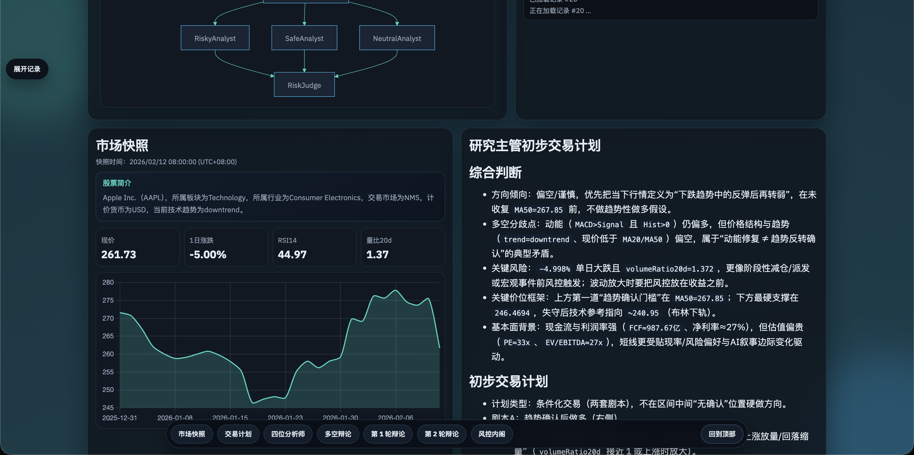

# Tradins (Next.js + Vercel)

Tradins 是一个以多智能体协作为核心的金融分析工作台。它不是“单模型一次性输出”，而是把分析拆成可追踪的协作链路，并将每个阶段实时展示。



## 多智能体流程核心

- 并行采集 + 并行研判：
  - 市场、基本面、新闻、舆情先并行采集
  - 四位分析师并行输出观点，缩短等待时间
- 对抗式推理：
  - Bull / Bear 进行多轮辩论
  - 每一轮都有独立产物，可回看推理演进
- 经理层汇总：
  - Research Manager 基于四分析师与辩论历史生成初步交易计划
- 风控内阁制衡：
  - 激进 / 保守 / 中立三方独立审议，再由 Risk Judge 给出最终裁定
  - 最终投资建议在报告开头和末尾均明确标注
- 全程流式可见：
  - 分析进度、阶段产物、市场快照按流程实时出现，不必等全链路完成


## 本地启动

建议 Node 版本：`22.x`。

1. 安装依赖

```bash
npm install
```

2. 配置环境变量（`.env.local`）

```bash
# LLM
TRADINS_BASE_URL=https://ai.268.pw/v1
TRADINS_API_KEY=your_api_key
TRADINS_MODEL=gpt-5.2
TRADINS_TEMPERATURE=0.2
TRADINS_MAX_TOKENS=1800
TRADINS_LLM_MAX_RETRIES=2
TRADINS_LLM_RETRY_BASE_MS=400
TRADINS_LLM_RETRY_MAX_MS=5000

# Scheduler 管理后台（/scheduler）
SCHEDULER_ADMIN_PASSWORD=your_scheduler_password
SCHEDULER_AUTH_SECRET=your_random_secret
SCHEDULER_RUN_TOKEN=your_runner_token

# Vercel Postgres（可选）
# POSTGRES_URL=...
# POSTGRES_PRISMA_URL=...
```

3. 启动开发环境

```bash
npm run dev
```

访问 [http://localhost:3000](http://localhost:3000)。

## 定时任务子页面

- 路径：`/scheduler`
- 默认要求密码登录（`SCHEDULER_ADMIN_PASSWORD`）
- 支持：创建任务、启停任务、手动执行、删除任务、查看下一次执行时间和最近执行结果
- 任务执行会复用现有多智能体分析流程，并写入分析记录

可选配置自动触发（例如 Vercel Cron）：

- `GET /api/scheduler/run`（Vercel Cron 默认 GET）
- 也兼容 `POST /api/scheduler/run`
- 鉴权方式：
  - 自定义调用：`x-scheduler-token` 或 `Authorization: Bearer <SCHEDULER_RUN_TOKEN>`
  - Vercel Cron：设置 `CRON_SECRET`，平台会自动携带 `Authorization: Bearer <CRON_SECRET>`

## 你会在页面看到什么

- 市场快照：价格、涨跌、RSI、量比、走势图、快照时间
- 研究主管初步交易计划：可在分析中途流式更新
- 四位分析师：市场/基本面/新闻/舆情独立报告
- 多空辩论：按轮次展示双方陈述与反驳
- 风控内阁与法官裁定：三派评审 + 最终建议

## 标的输入示例

- 美股：`AAPL`
- A 股：`688256` / `600519.SS` / `000001.SZ`
- 黄金：`GOLD` / `黄金`（映射到 `GC=F`，新闻/基本面代理符号 `GLD`）
- 白银：`SILVER` / `白银`（映射到 `SI=F`，新闻/基本面代理符号 `SLV`）

## 基础面数据备源策略

- 主源：Yahoo `quoteSummary` / `timeseries` / `insights`
- 备源：Yahoo `v7 quote`（用于在主源鉴权异常如 Invalid Crumb 时补齐关键估值字段）
- 当基础面仍不完整时，会返回用户友好提示，并在后续分析中自动下调基本面结论置信度

## 部署到 Vercel

1. 在 Vercel 创建项目并导入仓库
2. 在 Vercel 控制台添加 Postgres（Storage -> Postgres）
3. 配置环境变量：`TRADINS_BASE_URL`、`TRADINS_API_KEY`、`TRADINS_MODEL`，以及 Postgres 自动注入变量（`POSTGRES_URL` 等）
4. 触发部署

部署后会自动使用 `analysis_records` 表（首次写入时自动建表）。

## 目录结构

- `app/`：页面与 API routes
- `components/`：前端组件
- `lib/`：分析引擎、数据采集、LLM、数据库
